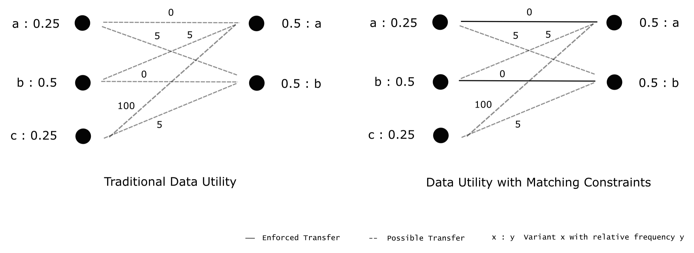

# Data Utility Metrics

*Data-utility*-based metrics primarily aim at assessing the similarity between original and anonymized data without computing intermediate data abstractions such as statistical models. In the context of process mining a prominent method is to compare the respective variant distributions of two event logs in a meaningful manner. We demonstrate that these distribution-oriented algorithms can be complemented with methods analyzing event logs based on absolute statistics. The underlying challenge rather lies in the interpretation of similarity and data quality which in turn depends on the data sources, -structure and experimental setup. To illustrate this ambiguity we additionally discuss brief examples.

## Relative Log Similarity

As a baseline for distribution-based utility metrics we refer to the *data utility* definition in \cite{priv_emd}. An algorithmic example of the workflow is depicted in the next figure. The algorithm first reads in the original- and the anonymized event log (*Log A*, *Log B*). To obtain both variant distributions, all absolute frequencies are then converted into relative numbers per log (*Distribution A*, *Distribution B*). As an example *Log A* contains 100 traces distributed over 3 variants which leads to a fraction of 0.5 for $\langle a,b,c \rangle$.    

Next, we define the similarity between single variants as their per-activity *LevenShtein* string edit distance. The underlying idea lies in the fact, that two activity sequences equal each other more with increasing sequence overlap. In our example $\langle a,b,c \rangle$ thus shares a cost of 1 edit operations with $\langle a,b \rangle$ due to the missing activity $c$. Recall that in \cite{priv_emd} all distance values are additionally normalized by the maximum sequence length of the two involved traces to constrain the final *relative log similarity* within a range of 0 to 1. Having prepared the full *LevenShtein* cost network, the essential goal is to align both variant distributions while minimizing the transfer cost. In a more technical sense this means all variant names with their relative frequencies in *Distribution A* have to be optimally converted into *Distribution B*. Whenever sequences cannot be perfectly matched during this procedure, the cost of the respective distance metric is accumulated (e.g. half of the share of $\langle a,b,c \rangle$ $(A)$ can be assigned to the 0.25 $\langle a,b,c \rangle$ $(B)$ without penalty whereas the remaining half leads to imperfect alignments at either $\langle a,b,c,d \rangle$ or $\langle a,b \rangle$ ($B$)). The corresponding optimization problem is solved by standard *Earth Moving Distance* (EMD) routines \cite{priv_emd}. As a result, an optimum indicates how much penalty we need at minimum to transform *Distribution A* into *Distribution B*, i.e. how similar both variant distributions are with respect to activity changes. The *relative log similarity* finally denotes this accumulated cost subtracted from 1.  

Although the metric allows to measure the distribution similarity in terms of sequence assignments, there are two caveats for event data applications. The first problem is related to situations where the minimum cost assignment does not coincide with logical variant matching. A simple example is depicted in the following image (left).
Due to the large cost differences, $c$ will be converted into $b$, avoiding the penalty 100 between $c$ and $a$. Consequently, both variants $b$ never produce a full link (0.5 to 0.5) which is undesired behaviour since they originate from the same sequence. Under the goal of evaluating event log similarities, it is therefore more logical to ensure matching all equal traces before computing the remaining mismatch (even if the overall solution is mathematically suboptimal).    

The second issue lies in the long runtime of standard *EMD* solvers on big inputs and thus rather represents an implementational challenge. During our experiments the *relative log similarity* computations demonstrated clear bottlenecks compared to both DP privatization engines and all other evaluation metrics.
As a remedy for both caveats we extend the traditional algorithm by prior direct matching constraints. In accordance with our aforementioned example this means that all equal variants are paired before optimization. The last figure (right) shows the corresponding enforced assignments on $a-a$ and $b-b$. Due to the fact that most event logs share a large fraction of their traces with their $(\epsilon,\delta)$-DP counterparts, this improvement therefore not only prevents illogical variant conversions, but also significantly speeds up the optimization runtime.
From a technical perspective, there are multiple ways to integrate such constraints into the *relative log similarity* algorithm. Subsequently we highlight the most common options and briefly justify our choice.

*  Removal of all mutual variants within both event logs before computing distributions as relative frequencies. In the former image this refers to $\langle a,b,c \rangle^{50}$ and $\langle a,b \rangle^{25}$, yielding only $\langle a \rangle^{25}$ in *Log A* and $\{\langle a,b,c,d \rangle^{250}, \langle a,b,c \rangle^{200}, \langle a,b,d,c \rangle^{475}\}$ in *Log B*. As a result all equal pairs are separated from the *EMD* optimizer which solves the matching problem and improves performance. However, the interaction with absolute counts distorts the distribution orientation of the final metric and thus makes it difficult to interpret.

* Direct integration of suitable edge constraints for all matching pairs of relative variant frequencies into the optimization problem. Recalling the bipartite-graph structure depicted in the first image, we would therefore enforce a minimum flow of 0.25 between the $\langle a,b,c \rangle$ and $\langle a,b \rangle$ vertices respectively. Consequently, the solution domain significantly shrinks and the *EMD* algorithm cannot select illogical matches. Although this approach operates on the distribution level, the optimizer still needs to deal with a potentially large number of constraints which reflects a new source of inefficiencies.

* Removal of all mutual relative variant frequencies (distribution overlap) with renormalization before *EMD* optimization. In our first image this denotes $\langle a,b,c \rangle : 0.25$ and $\langle a,b \rangle : 0.25$, leading to $\{\langle a,b,c \rangle : 0.25, \langle a \rangle : 0.25\}$ ($\{\langle a,b,c \rangle : 0.5, \langle a \rangle : 0.5\}$ after renormalization) in *Log A* and $\{\langle a,b,c,d \rangle : 0.25, \langle a,b \rangle : 0.25\}$ ($\{\langle a,b,c,d \rangle : 0.5, \langle a,b \rangle : 0.5\}$ after renormalization) in *Log B*.
Compared with the last alternative, we obtain the same effects on the *relative log similarity* computation, but avoid any inefficient constraints. Moreover, the resulting metric maintains its statistical interpretation and is comparable with the traditional version from \cite{priv_emd}. Due to these advantages, we choose this option for our enhancement.

