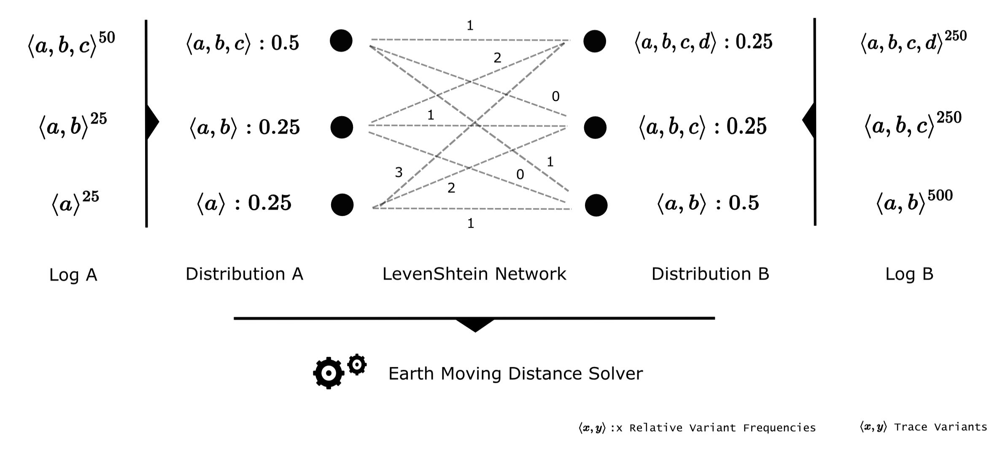

# Data Utility Metrics

*Data-utility*-based metrics primarily aim at assessing the similarity between original and anonymized data without computing intermediate data abstractions such as statistical models. In the context of process mining a prominent method is to compare the respective variant distributions of two event logs in a meaningful manner. We demonstrate that these distribution-oriented algorithms can be complemented with methods analyzing event logs based on absolute statistics. The underlying challenge rather lies in the interpretation of similarity and data quality which in turn depends on the data sources, -structure and experimental setup. To illustrate this ambiguity we additionally discuss brief examples.

## Relative Log Similarity

As a baseline for distribution-based utility metrics we refer to the *data utility* definition in \cite{priv_emd}. An algorithmic example of the workflow is depicted in the next figure. The algorithm first reads in the original- and the anonymized event log (*Log A*, *Log B*). To obtain both variant distributions, all absolute frequencies are then converted into relative numbers per log (*Distribution A, *Distribution B*). As an example *Log A* contains 100 traces distributed over 3 variants which leads to a fraction of 0.5 for $\langle a,b,c \rangle$.  

Next, we define the similarity between single variants as their per-activity *LevenShtein* string edit distance. The underlying idea lies in the fact, that two activity sequences equal each other more with increasing sequence overlap. In our example $\langle a,b,c \rangle$ thus shares a cost of 1 edit operations with $\langle a,b \rangle$ due to the missing activity $c$. Recall that in \cite{priv_emd} all distance values are additionally normalized by the maximum sequence length of the two involved traces to constrain the final *relative log similarity* within a range of 0 to 1. Having prepared the full *LevenShtein* cost network, the essential goal is to align both variant distributions while minimizing the transfer cost. In a more technical sense this means all variant names with their relative frequencies in *Distribution A* have to be optimally converted into *Distribution B*. Whenever sequences cannot be perfectly matched during this procedure, the cost of the respective distance metric is accumulated (e.g. half of the share of $\langle a,b,c \rangle$ $(A)$ can be assigned to the 0.25 $\langle a,b,c \rangle$ $(B)$ without penalty whereas the remaining half leads to imperfect alignments at either $\langle a,b,c,d \rangle$ or $\langle a,b \rangle$ ($B$)). The corresponding optimization problem is solved by standard *Earth Moving Distance* (EMD) routines \cite{priv_emd}. As a result, an optimum indicates how much penalty we need at minimum to transform *Distribution A* into *Distribution B*, i.e. how similar both variant distributions are with respect to activity changes. The *relative log similarity* finally denotes this accumulated cost subtracted from 1.