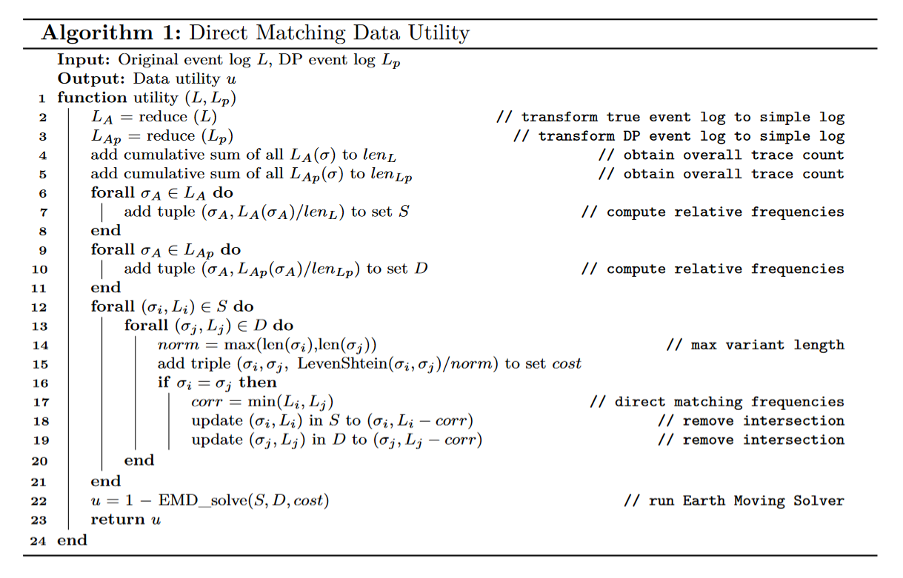
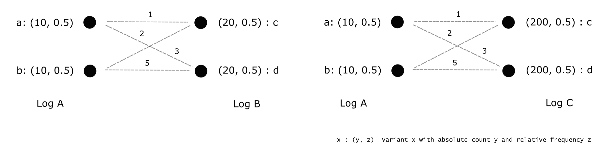
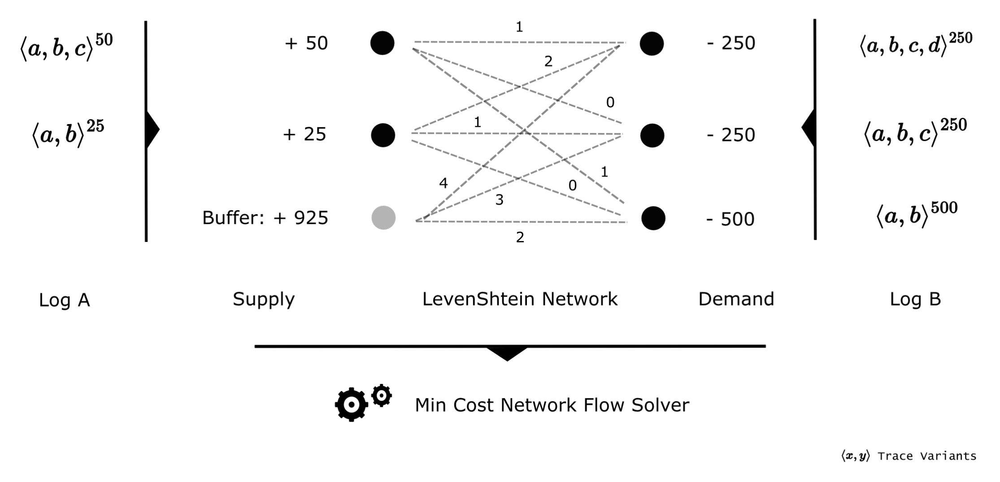
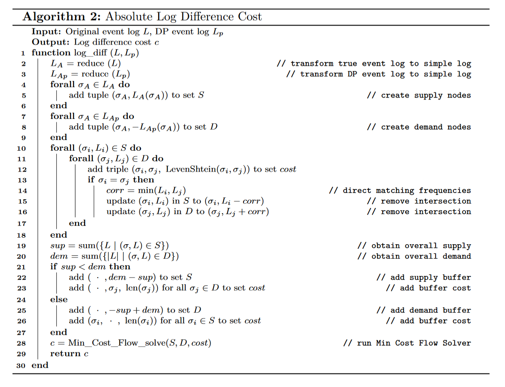

# Data Utility Metrics

*Data-utility*-based metrics primarily aim at assessing the similarity between original and anonymized data without computing intermediate data abstractions such as statistical models. In the context of process mining a prominent method is to compare the respective variant distributions of two event logs in a meaningful manner. We demonstrate that these distribution-oriented algorithms can be complemented with methods analyzing event logs based on absolute statistics. The underlying challenge rather lies in the interpretation of similarity and data quality which in turn depends on the data sources, -structure and experimental setup. To illustrate this ambiguity we additionally discuss brief examples.

## Relative Log Similarity

As a baseline for distribution-based utility metrics we refer to the *data utility* definition in \cite{priv_emd}. An algorithmic example of the workflow is depicted in the next figure. The algorithm first reads in the original- and the anonymized event log (*Log A*, *Log B*). To obtain both variant distributions, all absolute frequencies are then converted into relative numbers per log (*Distribution A*, *Distribution B*). As an example *Log A* contains 100 traces distributed over 3 variants which leads to a fraction of 0.5 for $\langle a,b,c \rangle$.    

Next, we define the similarity between single variants as their per-activity *LevenShtein* string edit distance. The underlying idea lies in the fact, that two activity sequences equal each other more with increasing sequence overlap. In our example $\langle a,b,c \rangle$ thus shares a cost of 1 edit operations with $\langle a,b \rangle$ due to the missing activity $c$. Recall that in \cite{priv_emd} all distance values are additionally normalized by the maximum sequence length of the two involved traces to constrain the final *relative log similarity* within a range of 0 to 1. Having prepared the full *LevenShtein* cost network, the essential goal is to align both variant distributions while minimizing the transfer cost. In a more technical sense this means all variant names with their relative frequencies in *Distribution A* have to be optimally converted into *Distribution B*. Whenever sequences cannot be perfectly matched during this procedure, the cost of the respective distance metric is accumulated (e.g. half of the share of $\langle a,b,c \rangle$ $(A)$ can be assigned to the 0.25 $\langle a,b,c \rangle$ $(B)$ without penalty whereas the remaining half leads to imperfect alignments at either $\langle a,b,c,d \rangle$ or $\langle a,b \rangle$ ($B$)). The corresponding optimization problem is solved by standard *Earth Moving Distance* (EMD) routines \cite{priv_emd}. As a result, an optimum indicates how much penalty we need at minimum to transform *Distribution A* into *Distribution B*, i.e. how similar both variant distributions are with respect to activity changes. The *relative log similarity* finally denotes this accumulated cost subtracted from 1.  

Although the metric allows to measure the distribution similarity in terms of sequence assignments, there are two caveats for event data applications. The first problem is related to situations where the minimum cost assignment does not coincide with logical variant matching. A simple example is depicted in the following image (left).
Due to the large cost differences, $c$ will be converted into $b$, avoiding the penalty 100 between $c$ and $a$. Consequently, both variants $b$ never produce a full link (0.5 to 0.5) which is undesired behaviour since they originate from the same sequence. Under the goal of evaluating event log similarities, it is therefore more logical to ensure matching all equal traces before computing the remaining mismatch (even if the overall solution is mathematically suboptimal).    

The second issue lies in the long runtime of standard *EMD* solvers on big inputs and thus rather represents an implementational challenge. During our experiments the *relative log similarity* computations demonstrated clear bottlenecks compared to both DP privatization engines and all other evaluation metrics.
As a remedy for both caveats we extend the traditional algorithm by prior direct matching constraints. In accordance with our aforementioned example this means that all equal variants are paired before optimization. The last figure (right) shows the corresponding enforced assignments on $a-a$ and $b-b$. Due to the fact that most event logs share a large fraction of their traces with their $(\epsilon,\delta)$-DP counterparts, this improvement therefore not only prevents illogical variant conversions, but also significantly speeds up the optimization runtime.
From a technical perspective, there are multiple ways to integrate such constraints into the *relative log similarity* algorithm. Subsequently we highlight the most common options and briefly justify our choice.

*  Removal of all mutual variants within both event logs before computing distributions as relative frequencies. In the former image this refers to $\langle a,b,c \rangle^{50}$ and $\langle a,b \rangle^{25}$, yielding only $\langle a \rangle^{25}$ in *Log A* and $\{\langle a,b,c,d \rangle^{250}, \langle a,b,c \rangle^{200}, \langle a,b,d,c \rangle^{475}\}$ in *Log B*. As a result all equal pairs are separated from the *EMD* optimizer which solves the matching problem and improves performance. However, the interaction with absolute counts distorts the distribution orientation of the final metric and thus makes it difficult to interpret.

* Direct integration of suitable edge constraints for all matching pairs of relative variant frequencies into the optimization problem. Recalling the bipartite-graph structure depicted in the first image, we would therefore enforce a minimum flow of 0.25 between the $\langle a,b,c \rangle$ and $\langle a,b \rangle$ vertices respectively. Consequently, the solution domain significantly shrinks and the *EMD* algorithm cannot select illogical matches. Although this approach operates on the distribution level, the optimizer still needs to deal with a potentially large number of constraints which reflects a new source of inefficiencies.

* Removal of all mutual relative variant frequencies (distribution overlap) with renormalization before *EMD* optimization. In our first image this denotes $\langle a,b,c \rangle : 0.25$ and $\langle a,b \rangle : 0.25$, leading to $\{\langle a,b,c \rangle : 0.25, \langle a \rangle : 0.25\}$ ($\{\langle a,b,c \rangle : 0.5, \langle a \rangle : 0.5\}$ after renormalization) in *Log A* and $\{\langle a,b,c,d \rangle : 0.25, \langle a,b \rangle : 0.25\}$ ($\{\langle a,b,c,d \rangle : 0.5, \langle a,b \rangle : 0.5\}$ after renormalization) in *Log B*.
Compared with the last alternative, we obtain the same effects on the *relative log similarity* computation, but avoid any inefficient constraints. Moreover, the resulting metric maintains its statistical interpretation and is comparable with the traditional version from \cite{priv_emd}. Due to these advantages, we choose this option for our enhancement.

 The final extended *relative log similarity* routine is presented as the following algorithm. In accordance with our schematic explanation from the initial figure, we first transform both event logs into their simple form ($L_A, L_{Ap}$), followed by the relative frequency derivation ($S, D$).

 

Next, the cost matrix is constructed as a network of normalized *LevenShtein* distances for all variant pairs ($cost$). At the same time, any overlapping variant frequencies (direct matches) between the two logs are removed from $S, D$ to implicitly link their frequency contribution.
Eventually, the cleaned distributions $S, D$ together with the cost matrix $cost$ are provided as inputs to the *EMD* solver function. Note, that the aforementioned renormalization steps on $S, D$ are commonly part of the solver's data preprocessing pipelines and therefore omitted in the last algorithm. Our implementation is integrated into the *dpv* Python package and can be found in this repository} (see implementation main folder).
For all our experiments, we employ this metric whenever two event logs need to be statistically compared with respect to their variant distribution.

## Absolute Log Difference

In contrast to the *relative log similarity*, we introduce our *absolute log difference* as a metric which measures the difference between two event logs based on absolute statistics instead of distributions. The main motivation for this additional evaluation tool originates from situations where the *EMD*-conditions of the *relative log similarity* are not well suited for measuring differences between event logs. In particular, when comparing original data to $(\epsilon,\delta)$-DP outputs, there are two important cases to differentiate. First, we consider the scenario of two DP event logs, maintaining similar variant distributions, but significant size differences. The *relative log similarity* would thus produce similar scores for both logs with respect to the original data although the DP method that produced the data most similar in size to the original log is clearly more accurate. An extreme example is shown in the following image.    

 

Whereas the left part depicts the variants ($a,b;c,d$) and the *LevenShtein* cost network between an original log *Log A* and its privatized complement *Log B*, the right part describes the same situation for another privatized event log *Log C* that only differs from *Log B* by its absolute variant numbers (200 instead of 20). As a result, both pairs would possess the exact same frequency distribution (0.5 on $a,b;c,d$) and thus the same *relative log similarity*, although *Log B* and *Log C* are distinct anonymized outcomes.

The second issue with our relative log similarity algorithm is linked to the relative *LevenShtein* cost construction instead of the distributions. As an example we consider the corresponding distances of three variant pairs. Let $w = \langle a,a\rangle$, $x = \langle a,a,b,b,\dots,b \rangle$ (10 times activity $b$), $y = \langle a,a,b,b,\dots,b \rangle$ (20 times activity $b$) and $z = \langle a,a,b,b,\dots,b \rangle$ (30 times activity $b$) be sample variants. The relative per-activity *LevenShtein* distance between $w-x$, $w-y$ and $w-z$ then yield $10/12$, $20/22$ and $30/32$ respectively. Even though the pairs $w-x$ to $w-y$ to $w-z$ constantly increase by an activity difference of 10, the penalty of the relative *LevenShtein* grows nonlinear-degressively and thus represents an illogical transfer cost function for highly divergent variant lenghts.
Furthermore, absolute item edit distances without normalization are easier to interpret than relative measures, in particular if they are utilized within an integer optimization routine.

Since different DP methods typically have considerably different impacts on both absolute variant frequencies and trace length, these two cases can be problematic when aiming at measuring the method performance with our *relative log similarity*. To provide a remedy for both issues, we design an *absolute log difference* metric that compares variants based on their absolute sequence changes and then finds an optimal variant assignment between two event logs. A simplified example operation is presented in the following image.

 

After the absolute variant frequencies are extracted from both logs (*Log A* and *Log B*), they are identified as supply and demand nodes of a bipartite graph (*Supply, Demand*). 
Subsequently, the overall frequency mismatch between *Log A* and *Log B* is assigned to a buffer node (*Buffer*) and the graph edges are established as a transfer cost network based on per-activity absolute *LevenShtein* distances. We consider the examples $\langle a,b,c \rangle^{50}$ and $\langle a,b,c,d \rangle^{250}$, leading to a supply of 50, a demand of 250 and an edit distance 1 (activity $d$).
Note that the *Buffer* represents a vertex to be assigned to all variants that are impossible to match similar neighbor variants. Hence, the cost of the incoming edges (4, 3 and 2) should always denote a separate maximum penalty with respect to the different transfer costs of the respective connected vertices (variants of *Log B*).
Finally, the resulting assignment problem is optimally solved with a minimum cost network flow algorithm.
As a result, the procedure measures event log differences by attempting to transform one event log into another event log while minimizing the required *LevenShtein* operations.
The optimal solution, i.e. the minimal accumulated penalty thus declares the number of activity changes by which the two logs differ.

Our complete *absolute log difference* algorithm is illustrated in the following image.

 

### References

[1] Rafiei M., van der Aalst, W. M. P.: Towards Quantifying Privacy in Process Mining, in Process Mining Workshops - ICPM 2020 International Workshops, Springer (2020)